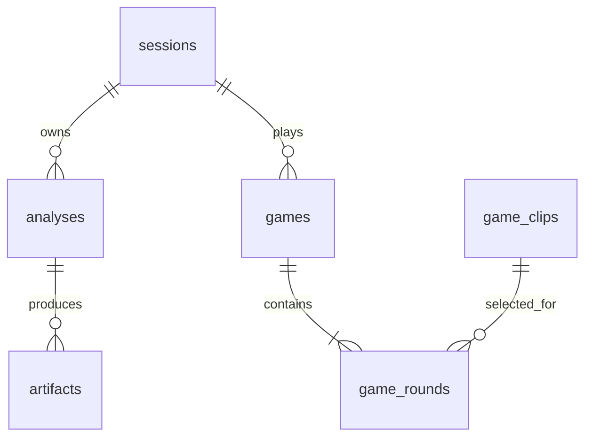

# DB 스키마 설계

실행 DDL: `migrations/schema.sql`, `migrations/002_games.sql`. API 시작 시 idempotent 초기화를 실행합니다. 현재 운영 엔진은 Python 내장 SQLite이며 DB 파일은 `data/deeptector.sqlite3`입니다.

## 관계

## 테이블과 필드

| 테이블 | 컬럼 | 목적/제약 |
|---|---|---|
| schema_version | version | 코어 스키마 버전, 불일치 시 시작 실패 |
| sessions | id PK, token_hash UNIQUE, created_at, expires_at | 익명 소유자, 토큰 원문 저장 안 함 |
| analyses | id PK, session_id FK, filename, source_path | 분석 식별자, 소유자, 표시 이름, 임시 파일 위치 |
| analyses | status, stage, created_at, updated_at, expires_at | 대기열/진행/수명 |
| analyses | result_json, error_json | 완료한 모델 결과 및 정책 snapshot 또는 실패 상세 |
| artifacts | id PK, analysis_id FK, kind, path, mime_type | 이미지 파일 위치, UNIQUE(analysis_id,kind) |
| game_clips | id PK, video_path, label, spatial, temporal | 검증된 영상 정답과 사전 계산 AI 점수 |
| game_clips | model_version, explanation, source, license, enabled | 출처·사용권·모델 추적, 신규 게임 사용 여부 |
| games | id PK, session_id FK, status, total_rounds, created_at | 게임 세션, 1~10문제 |
| game_rounds | game_id FK, ordinal, clip_id FK | PK(game_id,ordinal), UNIQUE(game_id,clip_id) |
| game_rounds | verdict, confidence, answered_at | 모두 NULL이거나 모두 채움. 제출 후 API 변경 불가 |

식별자는 UUID 문자열(운영자 정의 clip ID 제외), UTC 시각은 ISO 8601 문자열입니다. `analyses.status`는 QUEUED/PROCESSING/COMPLETED/FAILED, `games.status`는 ACTIVE/COMPLETED, 판정은 REAL/FAKE만 허용합니다. 게임 점수는 0~1 CHECK로 제한합니다.

분석 결과 JSON에는 `spatial`, `temporal`, `fused`, `n_faces`, `family`, `faithfulness`, `warnings`, `metadata`, `model_version`, `calibration_version`, `is_demo`, `policy`를 함께 저장합니다. 모델 결과를 하나의 불변 snapshot으로 저장해 정책 변경 후에도 과거 판정을 재현할 수 있게 합니다. 검색에 사용하는 소유자·상태·시각은 별도 컬럼으로 두며 JSON 전체를 목록 검색에 사용하지 않습니다.

## 인덱스 및 동시성

- 분석 `(status,created_at)` 인덱스: 가장 오래된 대기 작업 claim.
- 분석 `(session_id,created_at)` 인덱스: 소유자별 이력 pagination.
- 분석 `expires_at` 인덱스: 보관 기간 정리.
- game_rounds 복합 PK와 unique: 순서/중복 문제 방지.
- games `(session_id,created_at)` 인덱스: 세션별 게임 조회.

각 연결에서 foreign_keys를 활성화합니다. `BEGIN IMMEDIATE` 트랜잭션으로 작업 claim, 업로드 최종 quota 확인, 답변 제출을 직렬화합니다. 분석 모델 실행 중에는 DB 트랜잭션을 열어 놓지 않습니다. SQLite는 한 호스트의 소규모 서비스에 적합하며 DB 파일을 여러 서버의 네트워크 공유 드라이브에 두는 배포는 범위 밖입니다.

game_clips는 등록 CLI에서 insert-only입니다. 기존 게임의 정답/모델 점수가 바뀌지 않도록 기존 ID를 덮어쓰지 않고 새 ID로 등록하세요. curated 영상은 업로드 보관 정책의 대상이 아니며 운영자가 별도로 보관합니다.

## 상태·삭제 정책

`QUEUED → PROCESSING → COMPLETED/FAILED`. 실패 자동 재시도는 하지 않으며 사용자가 다시 업로드합니다. worker 중단 후 timeout+60초가 지난 작업은 다음 claim에서 FAILED 처리합니다. 소유자가 만료한 작업과 분석 만료 작업은 신규 실행에서 제외합니다.

원본 영상은 성공·실패 종료 시 삭제합니다. 메타데이터 및 XAI 결과는 기본 24시간 보관하고, `python -m app.worker --cleanup`이 만료 분석과 파일을 제거합니다. PROCESSING 작업은 cleanup에서 보류해 실행 중 파일을 삭제하지 않습니다. 중단된 worker의 작업은 먼저 worker를 재시작하여 stale 상태를 정리하세요. 참조가 사라진 오래된 파일도 정리합니다.

API는 만료 결과 접근을 차단하므로 cleanup 주기와 접근 만료가 분리됩니다. 삭제 API는 완료·실패 작업에만 허용합니다. 세션 만료 후 cleanup은 세션과 종속 게임/답변도 삭제합니다. FK cascade는 DB 행에 적용되며 파일 삭제는 애플리케이션 정리 로직이 담당합니다.

API 수용량 계산은 만료 레코드를 제외합니다. 상시 worker는 작업 사이에 60초 간격으로 cleanup을 시도하며 긴 작업 실행 중의 정리는 별도 스케줄러로 실행할 수 있습니다.

## PostgreSQL 전환 설계

현재 구현은 SQLite 전용입니다. 앞선 기획에서 DB 엔진이 정해지지 않았으므로 즉시 실행 가능한 DB를 제공하고 엔진 결정은 이식 경계를 명시하는 방식으로 처리했습니다. PostgreSQL로 전환하려면 다음을 구현·검증해야 합니다.

| SQLite 현재 | PostgreSQL 대응 |
|---|---|
| id TEXT | UUID (clip 외) |
| 시각 TEXT | TIMESTAMPTZ |
| result_json/error_json TEXT | JSONB |
| enabled INTEGER | BOOLEAN |
| `?` parameter | 선택 드라이버의 parameter 형식 |
| BEGIN IMMEDIATE claim | SELECT FOR UPDATE SKIP LOCKED + UPDATE |
| executescript 초기화 | 버전별 migration 및 upgrade/downgrade |
| 로컬 파일 path | 객체 저장소 object key + 인증 다운로드 |

`app/db.py` 연결/트랜잭션, `main.py`와 `game.py` 쿼리, `worker.py` claim을 이식해야 하며 `DATABASE_URL`만 변경해서 동작하지 않습니다. FK·unique·CHECK 제약과 owner 격리 테스트는 그대로 유지합니다. 다중 GPU/서버 규모에서는 전용 queue와 heartbeat lease도 도입합니다.

## 백업

실행 중인 SQLite 파일을 단순 복사하는 대신 sqlite backup API 또는 API/worker 중지 후 복사합니다. DB와 `storage/artifacts`를 일관된 시점에 함께 백업해야 이미지 링크가 유지됩니다. 임시 업로드는 장기 백업하지 않습니다.
